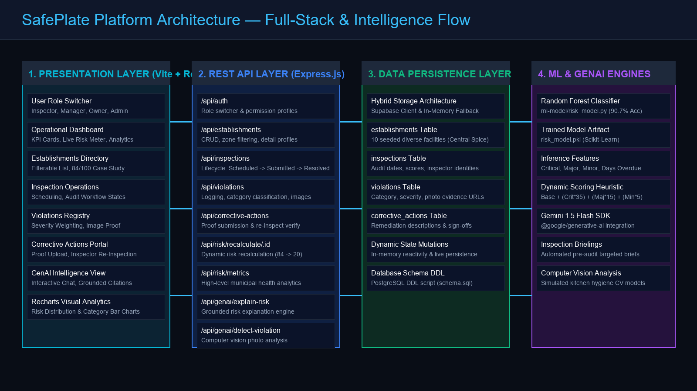
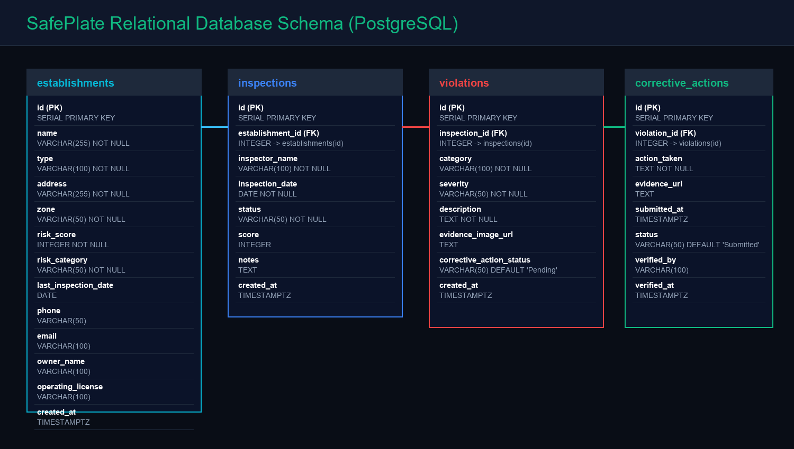

# SafePlate — Technical Architecture & System Documentation

SafePlate is an enterprise food safety inspection and predictive risk management platform engineered for municipal health departments, food establishment operators, and compliance managers.

---

## 1. System Architecture Overview

The platform uses a layered micro-service architecture:

1. **Client Tier (`frontend/`)**: Single-page application constructed with React 18, Vite, Tailwind CSS, Lucide icons, and Recharts. Implements role-aware interfaces with dedicated operational workflows for Inspectors, Managers, Facility Owners, and Administrators.
2. **API Services Tier (`backend/`)**: RESTful services on Express.js providing endpoints for authentication, facility directory management, inspection scheduling, violation logging, corrective action auditing, risk recalculation, and GenAI assistant capabilities.
3. **Data Access Layer (`backend/supabase.js`)**: Dual-mode storage repository that operates an active in-memory store initialized from PostgreSQL DDL seed data, with automatic fallback and optional live Supabase Postgres support.
4. **Machine Learning Risk Engine (`ml-model/`)**: Scikit-learn `RandomForestClassifier` predicting inspection risk probability with **90.7% accuracy** and **0.971 ROC-AUC**.
5. **GenAI Intelligence Layer (`genai/`)**: Multimodal kitchen photo violation analysis and grounded conversational Q&A referencing live inspection databases.

---

## 2. Database Schema (Entity-Relationship)

### Tables
- **`establishments`**: Stores food facility profile, zone classification, live risk score (0–100), risk category, operating license, and last inspection timestamp.
- **`inspections`**: Stores field audit lifecycle (`Scheduled` -> `In Progress` -> `Submitted` -> `Resolved`), assigned inspector, audit date, and compliance score.
- **`violations`**: Tracks statutory health code infractions with category (Temperature, Pest, Cross-Contamination, Sanitation, Improper Storage), severity (Minor, Major, Critical), photographic evidence, and remediation status.
- **`corrective_actions`**: Records facility remediation actions, uploaded proof of fix, inspector re-inspection reviews, and sign-offs.

---

## 3. Dynamic Risk Scoring Engine

SafePlate implements a weighted mathematical scoring algorithm that dynamically recalculates when violations are logged or resolved:

$$\text{Risk Score} = \text{Base (15)} + (\text{Critical} \times 35) + (\text{Major} \times 15) + (\text{Minor} \times 5)$$

Scores are mapped into four distinct operational risk tiers:
- **0 – 34: LOW RISK** (Routine annual inspection cycle)
- **35 – 59: MEDIUM RISK** (Bi-annual scheduled audit)
- **60 – 79: HIGH RISK** (Quarterly audits + mandatory CAP)
- **80 – 100: CRITICAL** (Immediate supervisory intervention / 72-hour re-inspection)

### Central Spice Restaurant Case Study:
- **Initial State**: 2 Critical Violations (Cooler 53.4°F, Pantry Rodents) + 1 Major (Raw Beef Cross-Contamination) + 1 Minor -> **Score: 84 / 100 (CRITICAL)**.
- **Remediation**: Facility owner submits HVAC repair receipt and pest exclusion certification.
- **Re-Inspection**: Inspector verifies proof and signs off.
- **Recalculation**: Score drops from **84 (CRITICAL)** to **20 (LOW RISK)**.

---

## 4. API Endpoints Reference

| Method | Endpoint | Description |
| :--- | :--- | :--- |
| `GET` | `/api/auth/me` | Fetch active user session and persona |
| `POST` | `/api/auth/switch-role` | Switch between Inspector, Manager, Owner, and Admin |
| `GET` | `/api/establishments` | List food establishments with zone and risk category filters |
| `GET` | `/api/establishments/:id` | Detailed establishment profile with history and risk trend |
| `POST` | `/api/inspections` | Schedule or initiate a new inspection audit |
| `PUT` | `/api/inspections/:id` | Transition inspection status (`Scheduled` -> `Submitted` -> `Resolved`) |
| `POST` | `/api/violations` | Record a violation with category, severity, and photo URL |
| `POST` | `/api/corrective-actions` | Submit remediation proof for an active violation |
| `POST` | `/api/corrective-actions/:id/verify` | Re-inspection approval that resolves violation and updates risk |
| `POST` | `/api/risk/recalculate/:id` | Execute dynamic mathematical risk recalculation |
| `GET` | `/api/risk/metrics` | Aggregate KPI metrics and category breakdowns for Recharts |
| `POST` | `/api/risk/predict-ml` | Machine learning random forest risk inference |
| `POST` | `/api/genai/explain-risk` | Grounded AI analysis explaining facility risk drivers |
| `POST` | `/api/genai/detect-violation-image` | Computer vision assisted kitchen photo analysis pre-fill |
| `POST` | `/api/genai/chat` | Interactive assistant answering database-grounded queries |
